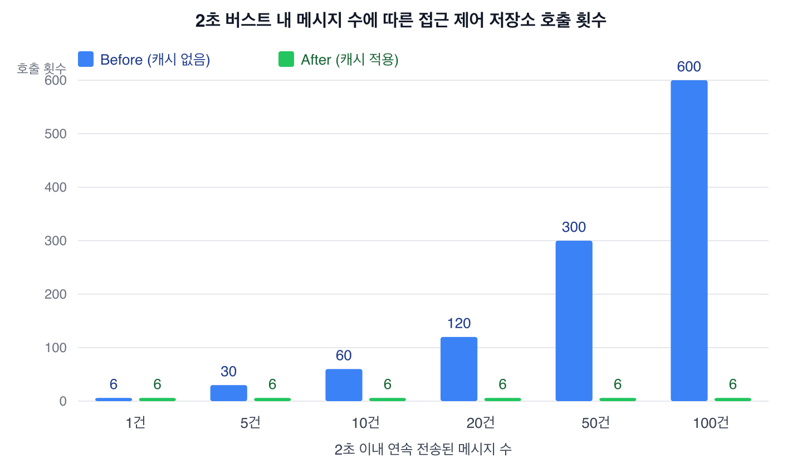

# WebSocket · MongoDB 성능 분석

`cowork-chat`의 실시간 메시지 파이프라인(WebSocket ↔ Kafka ↔ MongoDB)을 대상으로 진행한 성능 병목 분석 기록입니다. 분석 자체(2026-09-17 기준)는 코드 변경 없이 실제 코드·호출 흐름·쿼리 구조만 근거로 작성했으며, 이후 1번·3번 항목은 실제로 수정을 적용해 아래에 상태를 표시했다. 이후 코드가 더 바뀌면 이 문서의 위치·줄 번호는 최신 상태와 다를 수 있습니다.

## 배경

채널 메시지 전송이 늘어날 때 WebSocket 브로드캐스트와 MongoDB 조회가 실제로 어디서 반복되는지, 그리고 접속자·데이터 증가 시 어떤 부분이 먼저 한계에 부딪히는지 확인할 필요가 있었다. 일반적인 MongoDB/WebSocket 성능 가이드를 적용하는 대신, [chat.gateway.ts](../src/chat/chat.gateway.ts) → [chat.service.ts](../src/chat/chat.service.ts) → [chat-message.processor.ts](../src/chat/kafka/chat-message.processor.ts) → [message.repository.ts](../src/chat/repository/message.repository.ts)로 이어지는 실제 호출 경로를 추적했다.

## 분석 범위 및 방법

- WebSocket: [chat.gateway.ts](../src/chat/chat.gateway.ts) 연결 수명주기, [channel-message-read-access.service.ts](../src/chat/service/channel-message-read-access.service.ts)의 broadcast/room 로직, [redis-io.adapter.ts](../src/common/adapter/redis-io.adapter.ts)의 scale-out 구조.
- MongoDB: [message.repository.ts](../src/chat/repository/message.repository.ts), [channel-member.repository.ts](../src/chat/repository/channel-member.repository.ts)와 각 projection repository·schema의 쿼리 shape 대 인덱스 정의.
- 연계 경로: `sendMessage` → Kafka `chat.message` → [chat-message.consumer.ts](../src/chat/kafka/chat-message.consumer.ts) → `ChatMessageProcessor` → MongoDB 저장 → Socket.IO 브로드캐스트 전체 흐름.
- 벤치마크(부하 재현 측정)는 수행하지 않았다. 아래 수치는 실측 처리량이 아니라 코드 상 확인되는 **쿼리 횟수·라운드트립 수**다. 실제 지연시간에 미치는 영향의 크기는 채널당 메시지 빈도, MongoDB 네트워크 왕복 시간(RTT), 인스턴스 수에 따라 달라지므로 우선순위 판단의 참고 자료로만 사용한다.

## 이미 적절히 구현되어 있는 부분

억지로 개선점을 만들지 않기 위해, 실제로 문제가 없다고 확인한 부분을 먼저 기록한다.

- **Broadcast (별도 PR로 진행 중)**: `emitToReadableChannelUsers`가 room 소켓마다 개별 `emit()`을 호출하는 대신 `io.to(room).except(...).emit()` 한 번으로 처리하도록 하는 변경이 PR #386으로 진행 중이다. 이 문서를 작성한 브랜치의 기준(`develop`)에는 #386이 아직 병합되지 않아 개별 emit 방식이 남아있다 — 아래 분석과 이번 캐싱 작업은 어느 쪽 emit 방식이든 동일하게 적용되며 서로 독립적이다.
- **Scale-out**: [redis-io.adapter.ts](../src/common/adapter/redis-io.adapter.ts)로 Socket.IO Redis pub/sub이 이미 적용돼 있다. Kafka consumer group이 competing consumer로 동작해 메시지가 특정 인스턴스 하나에만 도착하는 구조상, 멀티 replica 환경에서는 room 브로드캐스트 동기화가 필수적이다. 현재 트래픽 규모와 무관하게 이미 정당한 구조이며, 추가 도입을 검토할 필요가 없다.
- **미읽음 카운트**: `UnreadCounterService`가 Redis cache-aside + Lua 스크립트로 원자적 증가를 처리하고, 캐시 미스일 때만 MongoDB로 폴백한다(`chat.service.ts:735-757`).
- **Rate limit**: `typing` 이벤트는 Redis sorted set 기반 슬라이딩 윈도우로 인스턴스 간에도 일관되게 제한된다([redis-rate-limiter.ts](../src/common/util/redis-rate-limiter.ts)).
- **인덱스**: `channel_members`, `team_member_projection`, `team_role_projection`, `channel_role_policy_projection` 등 접근 제어에 쓰이는 projection collection은 실제 조회 패턴과 일치하는 복합 인덱스가 이미 있다. `messages`의 `{channelId:1, _id:-1}`, `{channelId:1, parentMessageId:1, _id:-1}` 등도 실제 쿼리 shape과 일치한다.
- **Pagination**: `findMessages`, `findFileAttachments` 모두 `skip`이 아닌 `_id`/복합 커서 기반이다. 코드베이스 전체에서 `.skip()` 사용처는 없다.
- **N+1 회피**: [channel-message-read-access.service.ts](../src/chat/service/channel-message-read-access.service.ts), [notification-outbox.poller.ts](../src/chat/kafka/notification-outbox.poller.ts) 모두 배치 요청을 `Map`/`Set`으로 묶어 단일 쿼리로 처리한다.

## 발견된 문제

### 1. [Critical] 메시지 브로드캐스트마다 접근 제어를 처음부터 재계산함 — 조치 완료

**위치**
```
src/chat/kafka/chat-message.processor.ts:54  (ChatMessageProcessor.process)
src/chat/service/channel-message-read-access.service.ts:124-146, 202-301  (emitToReadableChannelUsers → evaluateMany → evaluate)
```

**기존 구조**

```
sendMessage (chat.service.ts:279)
 → Kafka chat.message 발행
 → ChatMessageConsumer.processKafkaMessage
 → ChatMessageProcessor.process
   → messageRepository.createMessage()                 // write 1회
   → channelMessageReadAccess.emitToReadableChannelUsers()
       → io.in(room).fetchSockets()                     // Redis adapter 사용 시 인스턴스 간 라운드트립
       → evaluate(mode='MESSAGE_READ')
           1) Promise.all([channelRepository.findByIds, channelMemberRepository.findByChannelIdsAndUserIds])  // RTT #1, 쿼리 2개
           2) teamMemberRepository.findByTeamIdsAndUserIds                                                     // RTT #2, 쿼리 1개
           3) teamRoleRepository.findAssignmentsByTeamIdsAndAccountIds (내부에서 assignment+tombstone 병렬 조회) // RTT #3, 쿼리 2개
           4) Promise.all([teamRoleRepository.findRolesByIds, policyRepository.findByChannelIdsAndRoleIds])    // RTT #4, 쿼리 2개
   → (emit 방식은 PR #386 병합 여부에 따라 다름 — 위 Broadcast 항목 참고)
```

**문제**

DM이 아니고 OWNER가 아닌 멤버가 포함된 팀 채널(가장 흔한 경우)에서는 메시지 한 건이 전송될 때마다 최대 4회의 **순차** Mongo 왕복(총 7개 쿼리)이 실행된다. 이 계산 대상인 채널·멤버·역할·정책 데이터는 사람이 멤버를 초대하거나 역할을 바꿀 때만 바뀌는, 메시지 발생 빈도보다 훨씬 낮은 빈도로 변하는 데이터다. 그런데도 캐시 없이 메시지마다 매번 처음부터 다시 계산한다. 개별 client마다 쿼리가 느는 구조(N+1)는 이미 배치 처리로 피했지만, 대신 **메시지 처리량에 비례해 동일한 계산이 반복**되는 형태의 병목이 남아 있다.

**현재 비용**
```
메시지 1건: Mongo 순차 왕복 최대 4회, 쿼리 최대 7회, fetchSockets() 1회
메시지 N건/초: Mongo 쿼리 최대 7×N회/초 — 채널 멤버·역할 변경 빈도와 무관하게 항상 재계산
```

**적용한 개선**

당초 검토안은 "채널 단위 원시 데이터 캐시 + 관련 Kafka 컨슈머에서 이벤트 기반 무효화"였다. 그런데 실제 호출부를 더 살펴보니 `MembershipConsumer`의 `LEAVE` 처리(`src/membership/membership.consumer.ts`)가 `evictUnauthorizedSockets()`가 아니라 `readAccessEvaluator`(=`canReadChannel`)를 **직접** 호출해 "방금 나간 사용자를 즉시 강퇴할지"를 결정하고 있었다. 이 호출까지 캐시를 타면 방금 나간 사용자가 캐시 TTL 동안 강퇴되지 않는 실질적인 보안 회귀가 생긴다.

그래서 캐시 적용 범위를 의도적으로 좁혔다:

- **캐시 적용**: `filterReadableUsersByChannel()` (메시지 브로드캐스트 수신자 산정 전용 진입점, `emitToReadableChannelUsers`가 호출) — `(channelId, userId)` 단위로 최근 판정을 저장하고, 2초마다 캐시를 세대(generation)째로 통째 비운다.
- **캐시 미적용(항상 최신 조회 유지)**: `canReadChannel`/`requireCanRead`(단건 멤버십·권한 검증, 편집·삭제·고정·반응·join에서 사용), `evictUnauthorizedSockets`(권한 회수 시 강제 퇴장), `evaluateVisibilityMany`(채널 메타데이터 가시성) — 이 경로들은 "권한을 잃은 사용자가 즉시 차단"되어야 하므로 캐시를 거치지 않는다.
- 구현: `ChannelMessageReadAccessService`에 `readableUsersCache: Map<string, boolean>` 필드와 `setInterval(2000ms)`로 캐시를 초기화하는 타이머를 추가. `evaluateMany`(원본, 무캐시)는 그대로 두고, `filterReadableUsersByChannel`만 새로 추가한 `evaluateManyCached()`를 거치도록 변경. 캐시 미스만 모아 기존 배치 평가(`evaluateMany`) 한 번으로 채운다.
- 별도의 이벤트 기반 무효화는 넣지 않았다 — TTL을 2초로 짧게 잡아 "막 초대된 사용자가 몇 초 늦게 메시지를 받기 시작하는" 정도의 그랜트 지연만 감수하고, 리보크(권한 회수)는 애초에 이 캐시를 거치지 않는 `evictUnauthorizedSockets`가 전담하므로 안전하다.

**검증 (Before/After)**

실제 서비스와 동일한 `ChannelMessageReadAccessService`를 저장소만 호출 횟수 카운터로 교체해, "2초 이내에 같은 채널·같은 접속자 조합으로 메시지가 연달아 도착하는" 상황을 재현했다(메시지 1~100건). `evaluateMany`를 직접 반복 호출(캐시 없음)한 경우와 `filterReadableUsersByChannel`을 반복 호출(캐시 적용)한 경우의 **저장소 메서드 호출 총합**을 비교했다 — 실제 MongoDB 왕복 시간이 아니라 저장소 호출 횟수를 측정한 것이며, 지금까지의 분석과 동일하게 실측 타이밍이 아닌 코드 기준 지표임을 밝힌다.

| 2초 내 연속 메시지 수 | Before(캐시 없음) | After(캐시 적용) |
|---|---|---|
| 1건 | 6 | 6 |
| 5건 | 30 | 6 |
| 10건 | 60 | 6 |
| 20건 | 120 | 6 |
| 50건 | 300 | 6 |
| 100건 | 600 | 6 |



첫 메시지는 캐시가 비어 있어 동일하게 저장소를 조회하고(6회), 이후 같은 채널·같은 접속자 조합의 메시지는 TTL(2초) 동안 캐시 히트로 처리되어 호출 횟수가 늘지 않는다. 접속자 구성이 바뀌면 바뀐 사용자만 다시 조회되고(부분 캐시 히트), 단건 권한 검증(`canReadChannel`)은 캐시를 거치지 않아 매번 새로 조회된다 — 이 세 가지 모두 유닛 테스트(`channel-message-read-access.service.spec.ts`)로 고정해두었다.

**기대 효과**: 짧은 시간에 메시지가 몰리는 활성 채널일수록 개선폭이 커진다(버스트 내 저장소 호출이 메시지 수에 비례 증가 → 사실상 상수). 메시지 브로드캐스트 지연시간 감소, 메시지량 증가에 선형 비례하던 DB 부하 제거.

**Trade-off**: 방금 채널에 초대되거나 권한을 새로 얻은 사용자는 최대 2초간 새 메시지를 받지 못할 수 있다(그랜트 지연). 반대로 권한을 잃은 사용자에게 한 번 더 메시지가 보이는 시나리오는 없다 — 리보크는 캐시를 거치지 않는 별도 경로가 즉시 처리한다. 활성 채널·접속자 규모에 비례한 캐시 메모리가 소폭 늘어난다.

### 2. [High] 편집·삭제·고정·반응 처리마다 접근 제어를 이중으로 계산함

**위치**
```
src/chat/chat.service.ts:531-553  editMessage
src/chat/chat.service.ts:564-578  deleteMessage
src/chat/chat.service.ts:590-629  pinMessage / unpinMessage
src/chat/chat.service.ts:641-689  addReaction / removeReaction
src/chat/chat.gateway.ts:264-289  relayTyping (typing:start/stop)
```

**현재 구조 / 문제**

이 액션들은 모두 `checkMembership(channelId, userId)`(요청자 1명에 대한 `evaluateMany`, 최대 7쿼리)로 접근 가능 여부를 먼저 확인한 뒤, 실제 작업을 수행하고, 다시 `emitToReadableChannelUsers`(room 전체에 대한 `evaluateMany`, 최대 7쿼리, 요청자 본인 포함)로 브로드캐스트 대상을 계산한다. 첫 번째 단계의 결과(요청자는 읽기 가능)는 두 번째 단계에서 그대로 다시 계산되고 버려진다. reaction은 채팅에서 가장 빈번한 액션 중 하나라 이 중복의 영향이 크다.

**현재 비용**: 액션 1건당 Mongo 쿼리 최대 14회(동일 계산 2회 반복).

**개선 방향**: 예외를 먼저 던지는 단건 검증과 브로드캐스트 대상 산정을 분리하지 말고, room 전체 평가 결과에서 요청자 본인의 판정을 함께 확인하는 방식으로 통합한다. (1번 항목에 캐시가 적용되면 이 중복의 실질 비용은 자연히 사라지지만, 캐시 여부와 무관하게 호출 구조 자체는 정리할 가치가 있다.)

**기대 효과**: 액션당 DB 쿼리 최대 50% 감소, 특히 reaction처럼 짧은 시간에 반복될 수 있는 액션에서 체감 효과가 크다.

**Trade-off**: 순수 중복 제거이므로 없음. 다만 "먼저 예외를 던지고 조기 반환"하던 흐름을 "평가 후 분기"로 바꾸는 리팩터링 범위가 있다.

### 3. [High] 신규 메시지 브로드캐스트가 내부 전용 필드까지 포함한 전체 도큐먼트를 그대로 전송함 — 조치 완료

`toMessageBroadcastPayload()`([message.repository.ts](../src/chat/repository/message.repository.ts))를 추가해 [chat-message.processor.ts:54](../src/chat/kafka/chat-message.processor.ts)에서 `saved.toObject()` 대신 이 함수를 사용하도록 변경했다. `MESSAGE_ROW_PROJECTION`과 동일한 필드만 남기고 아웃박스 내부 필드는 제외한다. 검증: `npx tsc --noEmit` 통과, 관련 스펙(`message.repository.spec.ts`, `chat.service.spec.ts`, `chat.gateway.spec.ts`) 62건 통과.

**위치**
```
src/chat/kafka/chat-message.processor.ts:54
```
```ts
await this.channelMessageReadAccess.emitToReadableChannelUsers(this.io, event.channelId, 'message', saved.toObject());
```

**현재 구조 / 문제**

REST로 메시지 목록을 조회하는 `MessageRepository.findMessages()`는 [MESSAGE_ROW_PROJECTION](../src/chat/repository/message.repository.ts)으로 클라이언트가 쓰는 필드만 명시적으로 골라 반환한다(코드 주석: "editHistory 등 클라이언트 미사용 필드 전송을 막는다"). 반면 새 메시지 저장 직후 WebSocket 브로드캐스트는 이 프로젝션을 거치지 않고 Mongoose 도큐먼트 전체를 `.toObject()`로 그대로 보낸다. [message.schema.ts](../src/chat/schema/message.schema.ts)에는 클라이언트와 무관한 내부 아웃박스 상태 필드가 12개 있다: `notificationStatus`, `notificationRetryCount`, `notificationProcessingStartedAt`, `notificationClaimId`, `searchIndexStatus`, `searchIndexVersion`, `searchIndexSyncedVersion`, `searchIndexRetryCount`, `searchIndexNextAttemptAt`, `searchIndexProcessingStartedAt`, `searchIndexClaimId`, `searchIndexLastError`, `searchIndexSyncedAt`.

REST 경로에서 의도적으로 숨기는 필드가 WebSocket 경로에서는 모든 접속 클라이언트에 그대로 노출되고, 메시지마다 불필요한 payload가 추가되며, REST/WS 응답 shape이 서로 달라지는 일관성 문제도 있다.

**개선 방향**: `ChatMessageProcessor.process()`에서 `saved.toObject()` 대신 `MESSAGE_ROW_PROJECTION`과 동일한 필드만 뽑은 plain object를 브로드캐스트한다.

**기대 효과**: 메시지당 network payload 축소, 불필요 필드 직렬화 비용 감소, 내부 구현 상태(아웃박스 처리 상태 등)의 클라이언트 노출 제거.

**Trade-off**: 없음. REST 경로와 동일한 프로젝션을 재사용하면 되므로 리스크가 낮다.

### 4. [Medium] 파일 목록 조회(`findFileAttachments`)에 `type` 인덱스가 없어 채널 크기에 비례해 느려짐

**위치**
```
src/chat/repository/message.repository.ts:380-446  (findFileAttachments)
src/chat/schema/message.schema.ts:225-262  (인덱스 목록)
```

**현재 구조**

```js
{ $match: { channelId, type: 'FILE', 'attachments.0': { $exists: true } } }
{ $unwind: { path: '$attachments', includeArrayIndex: 'attachmentIndex' } }
{ $match: cursorMatch }   // 선택적
{ $sort: { createdAt: -1, _id: -1, attachmentIndex: -1 } }
{ $limit: safeLimit + 1 }
```

`messages` 인덱스는 `{channelId:1, _id:-1}`, `{channelId:1, parentMessageId:1, _id:-1}`, `{isPinned:1, channelId:1}` 등은 있지만 `type` 필드가 포함된 인덱스는 없다.

**문제**

`channelId` 인덱스로 후보를 좁힌 뒤 `type: 'FILE'`과 `attachments.0` 존재 여부는 인덱스 없이 메모리에서 필터링한다. 필터링·`$unwind` 이후에 `$sort`가 오므로 정렬도 인덱스를 타지 못하고 in-memory sort가 된다. 이 쿼리의 비용은 요청 페이지 크기(`limit`)가 아니라 **그 채널의 전체 메시지 수**에 비례해서 커진다.

**현재 비용**: `O(채널 내 전체 메시지 수)` — 페이지 크기와 무관하게 채널 히스토리 전체를 훑는다.

**개선 방향**: 복합 인덱스 `{ channelId: 1, type: 1, createdAt: -1 }` 추가.

- **필요한 이유**: `$match`가 `channelId`+`type` equality 조건이라 이 두 필드로 먼저 후보를 걸러야 전체 스캔을 피할 수 있다.
- **필드 순서**: `channelId`가 항상 지정되는 equality 조건이라 앞에 두고, `type`도 equality라 순서 자체는 유연하지만 다른 채널별 조회와 인덱스 prefix를 공유하기 유리하도록 `channelId`를 선두에 둔다. `createdAt`은 정렬 기준이라 마지막에 둔다(Equality → Sort/Range 순서).
- **읽기 성능 개선 효과**: `$match`가 인덱스로 즉시 해결돼 스캔량이 "채널 전체 메시지 수"에서 "채널의 FILE 타입 메시지 수"로 줄어든다. `$unwind` 이후 정렬이라 완전한 index-backed sort는 아니지만, `$unwind` 이전 단계에서 후보 문서를 크게 줄이는 효과가 핵심이다.
- **write 비용**: 메시지 생성마다 인덱스 엔트리 1개 추가. `type`은 사실상 불변 필드라 update 비용은 없고 insert 시 B-tree 삽입 비용만 늘어난다.

**Trade-off**: 쓰기 빈도가 높은 컬렉션이라 인덱스 추가가 완전히 무비용은 아니지만, 이미 존재하는 인덱스 수 대비 증분은 작다. FILE 타입 메시지 비중이 매우 낮은 서비스라면 개선 체감이 작을 수 있어, 실제 채널당 FILE 메시지 분포를 먼저 확인하고 우선순위를 조정할 가치가 있다.

## 결론 및 우선순위

| 등급 | 문제 | 핵심 이유 |
|---|---|---|
| Critical | 1. 메시지 브로드캐스트마다 접근 제어 최대 7쿼리 재계산 — **조치 완료** | 메시지 처리량에 정비례해 커지는 유일한 항목, 실시간 전달 지연에 직결 |
| High | 2. 편집/삭제/고정/반응마다 접근 제어 이중 계산 | 순수 중복 계산, reaction처럼 고빈도 액션에 영향 |
| High | 3. 신규 메시지 브로드캐스트가 내부 필드까지 전체 전송 — **조치 완료** | 수정 리스크 낮고 즉시 적용 가능한 payload/정보노출 개선 |
| Medium | 4. 파일 목록 조회 `type` 인덱스 부재 | 특정 엔드포인트 한정, 채널 히스토리 증가 시 점진적으로 악화 |

Connection lifecycle(리스너/타이머 누수), 일반 broadcast 구조(O(n) 순회), backpressure/burst 제어, MongoDB connection pool·populate·bulkWrite 관련해서는 코드상 실제 문제를 확인하지 못해 이 문서에 포함하지 않았다.

### 후속 조치

- 1번·3번은 조치를 완료했다. 남은 2번(편집/삭제/고정/반응 이중 평가)과 4번(파일 목록 인덱스)은 위 우선순위대로 착수 여부를 정한다.
- 1번 캐싱은 TTL(2초) 기반이며 명시적 이벤트 무효화는 넣지 않았다. 그랜트 지연이 체감될 정도로 문제가 되면 그때 `evictUnauthorizedSockets` 호출 지점에 무효화 훅을 추가하는 것을 고려한다.
- 이 문서의 쿼리 횟수는 코드 추적 기준이며 실측이 아니다. 실제 적용 전후 효과는 로컬 인프라(kafka/mongo/es 컨테이너)에서 반복 측정으로 별도 검증이 필요하다.
