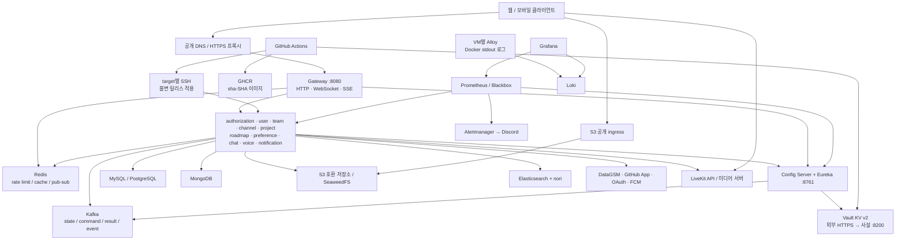

# prod 클라우드 구성 및 운영 인수인계

작성 기준일: **2026-09-12 KST**. 클라우드 담당자가 운영 구성을 대조하고 다음 배포를 준비하기 위한 문서다.
코드베이스, Git 이력, GitHub PR·배포 기록·설정 이름을 점검했다. 실제 VM·Vault·DB·방화벽·DNS에 접속하거나
운영 설정을 변경하지 않았다. 비밀번호, 토큰, SSH 개인키, Firebase JSON의 실제 값은 포함하지 않는다.

**기존 데이터의 유지·복구·이관 여부는 운영 담당자 재량이며 배포의 필수 조건이 아니다.**
이 문서는 필요한 운영 구성과 설정을 정리하며, 데이터 처리 방식은 지정하지 않는다.

빠른 이동:

- [현재 상태](#1-먼저-구분해야-할-현재-상태) · [아키텍처](#2-전체-아키텍처) · [서비스/VM](#3-서비스vm포트-인벤토리) · [인프라/데이터](#4-인프라와-영속-데이터)
- [네트워크](#5-네트워크dnstls-계약) · [GitHub 등록](#6-github에-등록할-설정) · [Vault 구조](#7-vault-데이터-구조와-권한)
- [runtime 63개 키](#8-배포-runtime-환경변수-전체-목록) · [앱 속성/시크릿](#9-config-server가-공급할-앱-속성과-시크릿) · [외부 연동](#10-외부-연동-준비)
- [Kafka 42개 토픽](#11-kafkaprojection초기-기동) · [모니터링/로그](#12-모니터링로그알림) · [배포/롤백](#13-배포설정-교체롤백-절차)
- [백업/용량](#14-백업용량장애-대응-인계) · [미완료 항목](#15-점검에서-확인한-미완료-항목과-조치-주체) · [최종 확인표](#16-담당자-최종-확인표) · [근거 이력](#17-근거-이력과-유지관리)

## 1. 먼저 구분해야 할 현재 상태

| 구분 | 확인 결과 | 해석 |
| --- | --- | --- |
| 이 문서의 코드 기준 | `develop`, `a3ed45afd8c6ed9bba2d20f87b87e733cf109a65`, `VERSION=20260912.0` | 아래의 새 배포 계약과 파일 경로는 이 커밋 기준이다. |
| 조회 당시 GitHub `main` | `45703f5d0f982fe3b813405ad22939e6ef67d085` | 운영 브랜치에 있는 코드이며, 실제 VM 실행 SHA를 뜻하지 않는다. |
| 운영 반영 PR | [#375 v20260912.0](https://github.com/team-cowork/cowork-server/pull/375), **OPEN** | Vault 중심 배포 체계는 아직 이 PR을 통해 `main`에 반영할 단계다. |
| 현재 방식 → 다음 방식 | `scripts/run/prod/*`·GitHub 개별 Secret → `deploy/prod/*`·Vault 배포 문서 | 예전 PR의 경로와 Secret 등록 명령을 새 방식에 그대로 적용하지 않는다. |
| GitHub 배포 Environment | `Prod-CD(...)` 14개 존재 | 새 방식의 `VAULT_ADDR`, `VAULT_DEPLOY_READ_TOKEN`은 14개 모두 미등록이다. |
| 설정 변경 Environment | `Config-Update(...)` 없음 | target별 환경과 `Config-Update(application)`을 준비해야 한다. |
| Environment 보호 | 14개 모두 `deployment_branch_policy=null`, `protection_rules=[]` | 문서에서 요구하는 `main` 브랜치 제한이 아직 없다. |
| 저장소·조직 상속 설정 | 저장소 Variables 없음. 필요한 Vault 연결 Secret 없음. 이 저장소에 제공되는 조직 Variables·Secrets도 없음 | 다른 범위에서 새 연결 설정이 상속되는 상태도 아니다. |
| 새 배포 성공 기준 | `task=cowork-runtime` Deployment 조회 결과 0건 | 추적 기능 도입 전이므로 첫 자동 배포는 inventory 전체가 선택될 수 있다. 서비스가 한 번도 운영된 적 없다는 뜻은 아니다. |
| 실행 중인 클라우드 | 미확인 | 실제 이미지, 프로파일, 주소, 클러스터 상태는 담당자가 확인해야 한다. |

조회 당시 최근 prod CD 5건은 모두 `failure`였으며 생성일은 9월 5일·7일·10일·11일 2건이다.
[가장 최근 실행](https://github.com/team-cowork/cowork-server/actions/runs/34565113103)은
`prepare`·`detect-changes`·이미지 빌드·release가 skipped이고 notify만 success였다.
이 결과만으로 개별 VM의 장애나 새 Vault 방식의 실패 원인을 판정할 수 없다.
최근 조회 8건 중 마지막 success는 [9월 4일 실행](https://github.com/team-cowork/cowork-server/actions/runs/33844407821)이며,
이 역시 모든 서비스의 현재 정상 동작을 보증하지 않는다.

**운영 반영 전 우선 처리할 항목**

1. 14개 target의 GitHub/Vault 설정과 SSH·GHCR 접근권한을 준비한다.
2. 운영에 사용할 Vault·모니터링 볼륨, DB, Kafka 토픽의 설정을 확인한다.
3. Config Server 8761과 하위 서비스·DB·Loki가 외부에서 직접 접근되지 않도록 실제 경계를 확인한다.
4. 현재 Kafka 토픽 계약과 LiveKit·S3 외부 접근 구성을 확인한다.
5. 준비 결과를 기록한 뒤 #375 반영과 새 SHA 배포를 진행한다. 이 문서 작성 과정에서는 병합·배포하지 않았다.

## 2. 전체 아키텍처

다음 그림은 **새 코드가 요구하는 논리 구성**이다. VM 수·공급자·VPC 이름·DNS·인증서 발급자는
저장소에 완전한 인프라 선언으로 관리되어 있지 않다. 여러 VM을 쓴다는 사실만으로 HA 구성은 성립하지 않는다.



- 외부 애플리케이션 HTTP 요청은 Gateway가 JWT를 검증한 뒤 하위 서비스에 전달한다.
  서비스는 `X-User-Id`, `X-User-Role`을 신뢰하고 리소스 권한을 검사하므로 직접 포트 노출은 인증 경계를 우회한다.
  Chat WebSocket handshake만 별도로 JWT를 검증한다.
- Eureka 등록 주소는 Gateway·다른 서비스·모니터링에서 도달할 수 있는 **VM 사설 주소와 host port**다.
  SSH 접속용 호스트/포트나 Docker 내부 IP를 그대로 등록하지 않는다.
- 각 서비스는 자신의 DB를 소유하고, 타 서비스 데이터는 주로 Kafka projection으로 유지한다.
  브로커 연결 성공과 projection 동기화 완료는 서로 다른 조건이다.
- LiveKit 미디어와 S3 presigned 요청은 별도 외부 경로가 필요하다. 일반 Gateway 라우팅만 준비해서는 완성되지 않는다.
- `cowork-promotion`은 Vercel 정적 사이트다. 위 앱 VM 배포 inventory 및 Config/Vault 클라이언트에 포함되지 않는다.

근거: [서비스 경계 규칙](../.claude/rules/service-boundaries.md),
[Gateway prod 설정](../cowork-config/src/main/resources/configs/cowork-gateway-prod.yml),
[배포 환경 매핑](../deploy/prod/lib/environment.sh).

## 3. 서비스·VM·포트 인벤토리

### 3.1 새 배포 스크립트 기준

14개 target은 **앱 이미지 12개 + monitoring + vault**다. `log-agent` 스크립트는 있지만 자동 inventory에는 없다.
아래 port는 기본값이며 실제 Vault `HOST_PORT`가 있으면 달라질 수 있다.

| target | 런타임 / 역할 | host → container TCP | 배포 상태 확인 경로 | 주요 저장소·외부 의존성 |
| --- | --- | --- | --- | --- |
| `config` | Kotlin/Spring, Config + Eureka | 8761 → 8761 | `/actuator/health` | Vault, Kafka; 공통 URL 배포 |
| `gateway` | Kotlin/Spring WebFlux, 진입점 | 8080 → 8080 | `/actuator/health` | Config/Eureka, Redis, Kafka |
| `authorization` | Go, 로그인·토큰·DataGSM | 8081 → 8081 | `/health` | MySQL, Kafka, DataGSM |
| `user` | Elixir, 사용자 | 8082 → 8082 | `/actuator/health/readiness` | MySQL, Kafka, Redis, S3 |
| `channel` | Kotlin/Spring, 채널·공유 계정 | 8083 → 8083 | `/actuator/health/readiness` | MySQL, Kafka, OAuth 제공자 |
| `project` | Java/Spring, 프로젝트·GitHub 연동 | **8089 → 8084** | `/actuator/health/readiness` | MySQL, Kafka, 외부 GitHub App 서비스 |
| `team` | Kotlin/Spring, 팀 | 8085 → 8085 | `/actuator/health/readiness` | MySQL, Kafka, S3, GitHub App 설정 |
| `notification` | Go, 알림·SSE·FCM | 8086 → 8086 | `/health/ready` | MySQL, Kafka, Firebase |
| `chat` | NestJS/Node.js, 채팅·검색·첨부 | 8087 → 8087 | `/health/ready` | MongoDB, Kafka, Redis, Elasticsearch, S3 |
| `roadmap` | Java/Spring WebFlux, 로드맵 | 8088 → 8088 | `/actuator/health/readiness` | MySQL(R2DBC + JDBC Flyway), Kafka |
| `voice` | Go, 음성 세션 | 8089 → 8089 | `/health/ready` | MongoDB, Kafka, Redis, LiveKit |
| `preference` | Kotlin/Vert.x, 설정·권한 정책 | **9001 → 9001 고정** | `/health/ready` | PostgreSQL, Kafka, Redis |
| `monitoring` | 별도 Compose | 아래 모니터링 표 참고 | Prometheus `/-/ready` 등 | 각 앱 및 인프라 exporter |
| `vault` | 별도 Compose, KV v2 | 사설 8200 → 8200 | `/v1/sys/health` | 지정한 영속 볼륨, HTTPS 프록시 |

`project`와 `voice`는 기본 host port가 모두 8089이므로 같은 VM의 같은 IP에 두려면 하나를 변경한다.
`preference`는 현재 광고 포트 구현 때문에 `HOST_PORT=9001`만 허용한다.
앱은 기본 `cowork-<service>` 컨테이너명으로 실행되며, 한 VM에 같은 서비스의 여러 target을 배치하는 구조는 지원하지 않는다.

근거: [inventory](../deploy/prod/inventory.json), [서비스별 스크립트](../deploy/prod/services/),
[이미지 카탈로그](../deploy/images/catalog.json).

### 3.2 과거 운영 배치 단서 — 현행 주소로 확정하지 말 것

조회 당시 `main`의 [구 CD workflow](https://github.com/team-cowork/cowork-server/blob/45703f5d0f982fe3b813405ad22939e6ef67d085/.github/workflows/cowork-prod-cd.yml)는
공통 SSH 호스트 Secret `COWORK_SSH_HOST`, 사용자 `ubuntu`, 아래 포트를 사용했다.
이는 **SSH 포워딩 포트**이며 앱 HTTP 포트가 아니다.

| 과거 SSH 포트 | 배포 대상 |
| --- | --- |
| 21108 | team, gateway, config, monitoring, vault |
| 24118 | channel |
| 24125 | authorization |
| 21133 | user |
| 24134 | project |
| 24153 | preference |
| 27108 | chat |
| 27109 | voice |
| 27110 | notification |
| 27112 | roadmap |

[#357](https://github.com/team-cowork/cowork-server/pull/357)에는 VM 패널의 HTTPS 도메인/방화벽 포워딩과
`ssh.gsmsv.site:21108`이 등장한다. 이 기록으로 AWS/GCP 등 공급자를 특정하거나 현재 DNS·연결 가능 여부를 확정할 수 없다.
새 방식에서는 운영에 사용할 값을 `deploy/<target>.ssh`에 지정한다. 같은 포트로 묶인 서비스의 실제 동거 여부와 자원 경쟁도 확인한다.

## 4. 인프라와 영속 데이터

아래 버전은 **저장소에 지정된 이미지**다. 운영 설치 버전이나 업그레이드 완료 상태가 아니다.
다중 VM CD가 직접 배포하는 인프라는 Vault·monitoring·선택적 log-agent이고,
DB/Kafka/Redis/S3/Elasticsearch/LiveKit의 다중 VM 생성·업그레이드는 inventory에 없다.

| 구성 요소 | 저장소 이미지 / 기본 포트 | 준비할 데이터·설정 |
| --- | --- | --- |
| MySQL | `mysql:9.7.1`, 3306 | 아래 7개 DB, 계정·권한, 영속 디스크, 백업 |
| PostgreSQL | `postgres:18.4`, 5432 | `cowork_preference`, `preference` schema, `search_path=preference,public` |
| MongoDB | `mongo:8.3`, 27017 | `cowork_chat`, `cowork_voice`; 현재 URI 생성은 `authSource=admin` |
| Kafka | `apache/kafka:4.3.0`, 앱 listener 9092/9094 | 실제 advertised listener, 토픽·partition·RF·보존 정책, 영속 데이터 |
| Redis | `redis:8.8.0-alpine`, 6379 | cache·rate limit·pub/sub; 데이터 보존과 장애 시 영향 범위 |
| SeaweedFS | `chrislusf/seaweedfs:4.44`, S3 9000 | bucket, key pair, CORS, 공개/비공개 정책 |
| Elasticsearch | `9.4.2` + `analysis-nori`, 9200 | MongoDB 기반 검색 색인, nori 플러그인, 디스크 |
| LiveKit | `livekit/livekit-server:v1.13.3` | API/WSS·RTC·TURN, 실제 node IP, key pair |
| Vault | `hashicorp/vault:2.0.3`, 8200 | file storage `/vault/data`, KV v2, 정책·토큰·unseal 자료 |

MySQL DB는 `cowork_authorization`, `cowork_user`, `cowork_team`, `cowork_project`, `cowork_channel`,
`cowork_notification`, `cowork_roadmap`이다. 현재 bootstrap은 하나의 MySQL 계정에 7개 DB 권한을 부여한다.
계정 분리를 도입하려면 서비스별 Vault 값·DSN과 실제 계정·권한이 일치해야 한다.

| 서비스 | 코드에 포함된 마지막 SQL migration | 적용 방식 |
| --- | --- | --- |
| authorization | V8 | Go 자체 migration runner |
| user | V20 | 이미지 entrypoint의 Flyway |
| team | V16 | Spring Flyway |
| channel | V23 | Spring Flyway |
| project | V18 | Spring Flyway |
| roadmap | V6 | 별도 JDBC 연결의 Flyway; 런타임 쿼리는 R2DBC |
| notification | V6 | Go 자체 migration runner |
| preference | V21 | 애플리케이션 기동 시 Flyway |

이 숫자는 저장소의 최대 버전이다. 운영 migration 이력과 checksum은 별도로 대조해야 한다.
기존 migration 파일을 수정하거나 앱 롤백만으로 DB 변경이 취소된다고 가정하지 않는다.
MongoDB projection·색인·quarantine은 SQL migration 표의 범위 밖이다.

공통 Compose는 Kafka broker/controller 1개와 RF 1, Elasticsearch single-node·인증 비활성,
Redis 인증 미지정 등을 포함한다. **로컬 기본 설정을 운영 인프라 설계로 복사하지 않는다.**
실제 TLS/인증 요구가 다르면 모든 런타임 클라이언트와 exporter의 지원을 함께 확인한다.
현재 `runtime`에는 Kafka SASL/TLS, Redis password 같은 일반화된 설정 항목이 없다.

근거: [공통 Compose](../deploy/compose/stack.yaml), [MySQL 초기화](../deploy/config/mysql/init.sh),
[PostgreSQL 초기화](../deploy/config/postgres/init.sh), [Elasticsearch 이미지](../deploy/images/elasticsearch/Dockerfile).

## 5. 네트워크·DNS·TLS 계약

### 5.1 허용 경로

| 출발지 → 목적지 | 포트/프로토콜 | 운영 조건 |
| --- | --- | --- |
| 사용자 → 공개 API 프록시 → Gateway | 외부 HTTPS 443 → 기본 TCP 8080 | HTTP·WebSocket upgrade·SSE 전달, 실제 public origin과 TLS 인증서 |
| Gateway·인가된 서비스·모니터링 → 앱 | 3.1의 host TCP port | VM 사설 주소로 bind하고 필요한 peer만 허용 |
| 앱·Gateway·모니터링 → Config/Eureka | 기본 TCP 8761 | 사설 control plane; Config 응답에 시크릿이 포함됨 |
| Actions·Config Server → Vault 프록시 | HTTPS, 기본 443 | 유효한 인증서·canonical 주소; Actions Vault client는 redirect를 거부 |
| Vault TLS 프록시 → Vault listener | 사설 TCP 8200 | 이 구간은 현재 HCL에서 TLS 비활성; 프록시만 접근 허용 |
| 각 앱·exporter → 해당 DB/Redis/검색 | 3306/5432/27017/6379/9200 | 실제 소유 서비스와 운영 관측 경로만 허용 |
| Kafka client → broker | 실제 advertised listener | bootstrap뿐 아니라 broker metadata의 모든 주소가 VM에서 접근 가능해야 함 |
| Actions → 각 VM SSH | Vault `ssh.port` | 실제 키 등록, 검증된 host fingerprint, 접근 가능한 네트워크 |
| VM → GHCR/GitHub | HTTPS 443 | 이미지·불변 SHA 소스 다운로드, DNS |
| VM별 Alloy → Loki | 사설 TCP 3100 | `/loki/api/v1/push`; Loki 자체 인증은 현재 비활성 |
| 운영자 → 모니터링 UI | 기본 localhost bind | 승인된 프록시/VPN/SSH tunnel 경로를 담당자가 정함 |
| 사용자·voice → LiveKit | 아래 표 | signaling과 media 모두 별도 경로 |
| 사용자 → S3 공개 ingress | HTTPS 443 권장 운영 URL | SigV4 host/path/query 보존, 업로드 크기·CORS·조회 정책 |
| 앱 → 외부 API | HTTPS 443 | DataGSM, GitHub App/GitHub, 사용 OAuth 제공자, Firebase, 사용 Discord webhook |

`gateway`만 기본 `BIND_IP=0.0.0.0`이고 다른 앱은 `BIND_IP=ADVERTISE_IP`다.
사설 IP bind만으로 방화벽 정책이 생기지는 않는다. Docker 게시 포트를 포함한 실제 접근 경로를 확인한다.
DB용 `mysql`, 브로커용 `kafka`, `redis`, `cowork-config` 등의 Docker 이름은 별도 VM에서 자동으로 해석되지 않는다.

### 5.2 공개 URL의 의미

| 설정 | 값의 형태 / 사용처 |
| --- | --- |
| `PUBLIC_WEB_ORIGIN` | 웹 origin. Gateway HTTP CORS·WS 허용 origin 및 OAuth 반환 대상 |
| `PUBLIC_API_BASE_URL` | 클라이언트가 사용하는 API base URL. OAuth callback 생성 기준 |
| `CONFIG_SERVER_URL` | 앱이 접근하는 Config Server base URL, `/eureka/`를 포함하지 않음 |
| `EUREKA_SERVER_URL` | Eureka API URL, 예: `http://config.internal:8761/eureka/` |
| `VAULT_ADDR` | GitHub Environment의 Vault HTTPS URL |
| `VAULT_EXTERNAL_HOST` | Config/Vault 배포 runtime의 **호스트명만**, 스킴·경로 제외 |
| `S3_INTERNAL_ENDPOINT` | 서버의 S3 접근 주소 |
| `S3_PUBLIC_ENDPOINT` | 브라우저가 접근할 S3 endpoint. 내부 주소와 같다고 가정하지 않음 |
| `S3_PUBLIC_BASE_URL` | 응답 URL 생성에 사용하는 공개 base. bucket 경로 포함 여부를 실제 계약과 대조 |
| `LIVEKIT_URL` | voice가 호출하는 LiveKit 서버 API |
| `LIVEKIT_WS_URL` | 사용자에게 반환하는 LiveKit WebSocket URL |
| `GITHUB_APP_SERVICE_URL` | 이 저장소 밖 GitHub App 연동 서비스의 base URL |

Gateway의 주요 공개 경로는 `/api/<service>/...`, Chat `/ws/chat/**`,
알림 SSE `/api/notification/notifications/stream`, 문서 `/v3/api-docs/<service>`다.
일반 API는 `StripPrefix=2`, Chat WS는 원래 경로를 전달한다. SSE route의 `response-timeout=-1`을
상위 프록시의 짧은 idle timeout이나 응답 buffering이 무효화하지 않도록 한다.
DataGSM webhook은 `/api/authorization/events/datagsm`, LiveKit webhook은 `/api/voice/voice/webhook`이다.
인증 예외 경로에도 각 제공자의 webhook 검증 조건은 유지해야 한다.

## 6. GitHub에 등록할 설정

### 6.1 새 방식의 등록 위치

대상: `authorization`, `channel`, `chat`, `config`, `gateway`, `monitoring`, `notification`,
`preference`, `project`, `roadmap`, `team`, `user`, `vault`, `voice`.

| 위치 | 종류 | 이름 | 요구사항 |
| --- | --- | --- | --- |
| `Prod-CD(<target>)` | Variable | `VAULT_ADDR` | runner에서 접근 가능한 Vault HTTPS URL |
| `Prod-CD(<target>)` | Secret | `VAULT_DEPLOY_READ_TOKEN` | 해당 `deploy/<target>`와 사용하는 참조 경로만 read |
| `Config-Update(<target>)` | Variable | `VAULT_ADDR` | 위와 같은 Vault |
| `Config-Update(<target>)` | Secret | `VAULT_CONFIG_WRITE_TOKEN` | 대상 배포 문서·허용 앱 속성 경로의 create/update |
| 위 두 종류의 환경 | Variable | `VAULT_KV_MOUNT` | 기본 `secret`과 다를 때만 지정 |
| `Config-Update(<target>)` | Secret | `VAULT_UPDATE_JSON` | 변경 실행 시 전체 문서 JSON을 임시 등록, 성공 후 삭제 |
| `Config-Update(application)` | Variable/Secret | `VAULT_ADDR`, `VAULT_CONFIG_WRITE_TOKEN` | 공통 앱 속성 전용; mount가 다르면 위 변수 추가 |
| `Prod-CD(vault)` | Secret | `VAULT_BOOTSTRAP_JSON` | Vault 중단·봉인 시 외부 참조 없이 SSH와 기동값을 제공하는 복구 자료 |
| 저장소 Secret | Secret | `DISCORD_INFORMATION_ALERT_CHANNEL_WEBHOOK` | CI/CD 결과 알림. 현재 등록되어 있음 |
| Actions 자동 발급 | Token | `GITHUB_TOKEN` | 이미지 게시·release·Deployment 기록에 사용. 수동 신규 Secret 아님 |

모든 배포/설정 변경 Environment는 `main`만 허용하도록 설정한다.
`Prod-CD(application)`은 만들지 않는다. log-agent를 추가하면 VM별 target의 두 Environment도 추가한다.
새 코드의 workflow-level guard와 Environment 브랜치 제한을 함께 유지한다.

### 6.2 현재 남아 있는 구 Secret 이름

값은 조회하지 않았으며, GitHub Secret 값은 이름 목록으로 복구할 수 없다.

| 범위 | 확인된 이름 |
| --- | --- |
| 저장소 | `CD_DEPLOY_SSH_KEY`, `COWORK_SSH_HOST`, `COWORK_MYSQL_PASSWORD`, `JWT_SECRET`, `GHCR_TOKEN`, `DISCORD_INFORMATION_ALERT_CHANNEL_WEBHOOK` |
| 저장소의 기타 기존 접속 설정 | `CHANNEL_SSH_KEY`, `CHANNEL_SSH_PASSWORD`, `CHANNEL_SSH_PORT`, `CHANNEL_SSH_USER`, `TEAM_SSH_KEY`, `TEAM_SSH_PASSWORD`, `TEAM_SSH_PORT`, `TEAM_SSH_USER`, `INFRA_HOST`, `INFRA_SSH_KEY` |
| `Prod-CD(chat)` | `COWORK_MONGO_PASSWORD` |
| `Prod-CD(preference)` | `COWORK_POSTGRES_PASSWORD` |
| `Prod-CD(project)` | `COWORK_GITHUB_APP_INTERNAL_API_KEY` |
| `Prod-CD(voice)` | `COWORK_MONGO_PASSWORD`, `LIVEKIT_API_KEY`, `LIVEKIT_API_SECRET` |

새 workflow는 이 값들을 자동 이관하지 않는다. Vault에는 운영에 사용할 설정값을 등록한다.
기존 값과 참조의 재사용·폐기 여부는 담당자 재량이다. `GHCR_TOKEN`이라는 구 이름을
새 배포의 `GHCR_READ_TOKEN`과 동일한 자동 연결로 취급하지 않는다.

## 7. Vault 데이터 구조와 권한

### 7.1 경로와 토큰 분리

| KV v2 논리 경로 (`secret` mount) | 내용 | 접근 주체 |
| --- | --- | --- |
| `deploy/<target>` | SSH, VM·인프라 주소, 프로파일, 컨테이너 env 또는 참조 | target 배포 읽기 토큰 / 설정 쓰기 토큰 |
| `application`, `application/prod` | 공통 DB·JWT·S3 속성 | Config Server 및 필요한 배포 참조 |
| `cowork-<service>`, `cowork-<service>/prod` | 서비스 고유 속성·시크릿 | Config Server 및 필요한 배포 참조 |
| `cowork-notification/prod` | 특히 `fcm.credentials-json` | notification에 제공하는 앱 속성 |

예: KV UI의 `deploy/project`는 API/정책 경로로 `secret/data/deploy/project`다.
mount가 바뀌면 정책, GitHub `VAULT_KV_MOUNT`, Config `VAULT_BACKEND`를 같이 맞춘다.

- 배포 읽기 토큰: 대상 배포 문서와 실제 참조 경로의 `read`만 허용한다.
- 설정 쓰기 토큰: 지정 문서의 `create`, `update`만 허용한다. `scope=application`으로 수정할 경로도 별도 허용한다.
- Config Server `VAULT_TOKEN`: 실제 사용하는 `application[/prod]`, `cowork-*[/prod]` 앱 경로만 읽는다.
  SSH 개인키를 담은 `deploy/*`는 허용하지 않는다. 앱 속성 읽기에 root token을 사용하지 않는다.
- 자동 단기 인증·토큰 회전은 아직 구현되지 않았다. 발급 담당자, 만료일, 교체 절차, 복구 경로를 기록한다.
- 최초 초기화·unseal key 보관은 별도 운영 작업이다. local seed는 운영에서 사용하지 않는다.

### 7.2 배포 문서 예시

아래는 실제값을 넣기 위한 **project 양식**이다. Vault UI에는 API의 `data` wrapper 없이 저장한다.
이 파일 자체를 운영 Secret으로 쓰기 전에 모든 예시 주소와 placeholder를 교체한다.

```json
{
  "ssh": {
    "host": "REPLACE_WITH_SSH_HOST",
    "port": 22,
    "user": "REPLACE_WITH_DEPLOY_USER",
    "key": "REPLACE_WITH_PRIVATE_KEY_PEM",
    "fingerprint": "SHA256:REPLACE_WITH_VERIFIED_HOST_FINGERPRINT"
  },
  "runtime": {
    "APP_CONFIG_PROFILE": "prod",
    "ADVERTISE_IP": "10.0.1.12",
    "BIND_IP": "10.0.1.12",
    "HOST_PORT": "8089",
    "CONFIG_SERVER_URL": "http://config.internal:8761",
    "EUREKA_SERVER_URL": "http://config.internal:8761/eureka/",
    "KAFKA_BOOTSTRAP_SERVERS": "kafka.internal:9094",
    "MYSQL_HOST": "mysql.internal",
    "MYSQL_USER": "cowork",
    "GITHUB_APP_SERVICE_URL": "http://github-app.internal:3000/",
    "HEALTH_TIMEOUT_SECONDS": "420"
  },
  "runtime_refs": {
    "COWORK_MYSQL_PASSWORD": {"path": "application", "key": "MYSQL_PASSWORD"},
    "COWORK_GITHUB_APP_INTERNAL_API_KEY": {
      "path": "cowork-project",
      "key": "github-app.internal-api-key"
    }
  },
  "application": {}
}
```

- `ssh`는 `host`, `port`, `user`, `key`, `fingerprint` 다섯 필드가 필수다. `port`만 정수다.
- `runtime`, `application`의 값은 **문자열**이다. JSON 안의 PEM/JSON 줄바꿈은 정상 JSON 직렬화로 보존한다.
- 허용 최상위 필드는 `ssh`, `runtime`, `application`, `runtime_refs`, `application_refs`뿐이다. **`files`는 지원하지 않는다.**
- `runtime`은 배포 스크립트의 환경이다. 모든 키가 컨테이너에 그대로 전달되는 것은 아니다.
  컨테이너에 직접 추가할 키는 `application` 또는 `application_refs`에 둔다.
- 참조는 `{"path":"...","key":"..."}` 형태이며 같은 이름을 값과 참조에 중복 선언할 수 없다.
  base 경로와 `/prod` 경로 중 실제 값이 있는 경로를 지정한다. 프로파일별 자동 참조 합성은 없다.
- `configuration_version`은 `deploy/<target>` 버전만 고정한다. 참조 문서는 **최신 버전**을 읽는다.
  참조 버전은 workflow 로그에 표시되지만 배포 rollback 시 자동 복원되지 않는다.
- 애플리케이션 설정 변경은 flat JSON key를 사용한다. `db.dsn`, `preference.db.password`를 중첩 객체로 바꾸지 않는다.
- `VAULT_UPDATE_JSON`은 전체 문서 교체 입력이다. 유지할 기존 키까지 포함하고 현재 버전을 `expected_version`으로 지정한다.
  `0`은 새 경로 생성 시에만 사용한다. JSON 변경 입력은 GitHub Secret 크기 제한, 전달 snapshot은 코드상 64 KiB 제한을 받는다.

근거: [설정 스키마·Vault client](../deploy/prod/vault-settings.py),
[VM 적용기](../deploy/prod/apply-settings.py), [기본 양식](../deploy/prod/settings.example.json).

## 8. 배포 runtime 환경변수 전체 목록

아래는 `vault-settings.py`의 `RUNTIME_KEYS` 전체를 용도별로 묶은 목록이다.
**모든 target에 모든 키를 넣는다는 뜻은 아니다.** 필수 조합은 8.2를 따른다.

### 8.1 키 사전

| 분류 | 허용 키 | 기본값 / 의미 |
| --- | --- | --- |
| 앱 프로파일 | `APP_CONFIG_PROFILE` | 앱·config 필수. 지원값 `local`, `prod`; 운영에 사용할 프로파일 명시 |
| VM 식별·바인딩 | `ADVERTISE_IP`, `BIND_IP`, `HOST_PORT` | 광고 주소 필수. bind 기본값은 5.1, port 기본값은 3.1 |
| 상태 대기 | `HEALTH_TIMEOUT_SECONDS` | 기본 `420`; 1~9999 정수. SSH 전체 timeout과 복구 시간도 함께 산정 |
| 설정·발견 | `CONFIG_SERVER_URL`, `EUREKA_SERVER_URL` | config를 제외한 앱의 접근 URL |
| Kafka | `KAFKA_BOOTSTRAP_SERVERS` | 실제 broker 주소 목록; `voice`·`notification`에는 `KAFKA_BROKERS`로 전달 |
| MySQL | `MYSQL_HOST`, `MYSQL_PORT`, `MYSQL_USER`, `COWORK_MYSQL_PASSWORD` | port 기본 `3306`; 서비스별 DSN/DB env로 변환 |
| PostgreSQL | `POSTGRES_HOST`, `POSTGRES_PORT`, `POSTGRES_USER`, `COWORK_POSTGRES_PASSWORD` | port 기본 `5432`; preference용 |
| MongoDB | `MONGO_HOST`, `MONGO_PORT`, `MONGO_USER`, `COWORK_MONGO_PASSWORD` | port 기본 `27017`; chat/voice URI 생성 |
| Redis | `REDIS_HOST`, `REDIS_PORT` | port 기본 `6379`; voice는 `REDIS_ADDR`로 변환 |
| 검색 | `ELASTICSEARCH_URL` | chat에서 접근 가능한 Elasticsearch URL |
| S3 | `S3_INTERNAL_ENDPOINT`, `S3_PUBLIC_ENDPOINT`, `S3_PUBLIC_BASE_URL`, `S3_BUCKET`, `S3_ACCESS_KEY`, `S3_SECRET_KEY` | bucket 기본 `cowork-bucket`; key pair는 실제 서버 설정과 일치 |
| LiveKit | `LIVEKIT_URL`, `LIVEKIT_WS_URL`, `LIVEKIT_API_KEY`, `LIVEKIT_API_SECRET` | 서버 API·클라이언트 WSS·서명 key pair |
| GitHub App | `GITHUB_APP_SERVICE_URL`, `COWORK_GITHUB_APP_INTERNAL_API_KEY` | project는 후자를 `GITHUB_APP_INTERNAL_API_KEY`로 전달 |
| 공개 앱 주소 | `PUBLIC_WEB_ORIGIN`, `PUBLIC_API_BASE_URL` | config의 prod 필수, 공통 overrides로 배포 |
| JWT | `JWT_SECRET`, `JWT_ACCESS_EXPIRE`, `JWT_REFRESH_EXPIRE` | chat 직접 검증용 secret; authorization 만료 기본 `30m`, `2160h` |
| Vault 접속 | `VAULT_EXTERNAL_HOST`, `VAULT_PORT`, `VAULT_BACKEND`, `VAULT_TOKEN` | config용 HTTPS, port 기본 `443`, backend 기본 `secret` |
| Vault 저장·복구 | `VAULT_BIND_IP`, `VAULT_DATA_VOLUME`, `VAULT_COMPOSE_PROJECT`, `VAULT_UNSEAL_KEY` | 사용할 외부 볼륨 이름 필수. project 기본 `vault`; sealed 상태에서 unseal key 필요 |
| 모니터링 바인딩·볼륨 | `MONITORING_BIND_IP`, `MONITORING_ADMIN_BIND_IP`, `MONITORING_COMPOSE_PROJECT`, `MONITORING_VOLUME_PREFIX` | admin bind 기본 `127.0.0.1`, project 기본 `cowork-monitoring`; 사용할 볼륨 접두사 필수 |
| 모니터링 인증·알림 | `GRAFANA_ADMIN_PASSWORD`, `DISCORD_WEBHOOK_URL` | Grafana 계정·Alertmanager 알림. CI/CD webhook과 별도 계약 |
| exporter | `MYSQL_EXPORTER_USER`, `MYSQL_EXPORTER_PASSWORD`, `KAFKA_EXPORTER_SERVER`, `POSTGRES_EXPORTER_DSN`, `MONGO_EXPORTER_URI` | MySQL exporter user 기본 `root`; 운영에서는 필요한 관측 권한을 검토. Kafka는 도달 가능한 broker 1개 |
| VM 로그 수집 | `LOG_HOST`, `LOKI_PUSH_URL`, `DOCKER_CONTAINER_LOG_DIR` | 안정적인 VM 이름, push URL; log dir 기본 `/var/lib/docker/containers` |
| private 이미지 | `GHCR_READ_TOKEN` | 필요 시 `docker login`에 사용. 공개 패키지이면 생략 가능 |

`DEPLOY_SHA`, `DEPLOY_IMAGE_OWNER`, `DEPLOY_IMAGE_TAG`, `DEPLOY_TARGET`, `DEPLOY_SETTINGS_DIR`,
`DEPLOY_STATE_DIR` 등은 적용기가 생성한다. 이를 Vault runtime에 임의 추가하면 스키마 검증에 실패한다.
`S3_REGION`, `JAVA_TOOL_OPTIONS`, 토픽별 override처럼 위 표에 없는 컨테이너 설정은
앱이 읽는 속성인지 확인한 뒤 앱 Vault 경로나 `application`에 둔다.

### 8.2 target별로 준비할 runtime 묶음

모든 앱(config 포함)은 `APP_CONFIG_PROFILE`, `ADVERTISE_IP`를 준비한다.
config 외 앱은 `CONFIG_SERVER_URL`, `EUREKA_SERVER_URL`, `KAFKA_BOOTSTRAP_SERVERS`를 준비한다.
서버 도달성에 필요한 값은 스크립트의 명시적 `require_env` 유무와 관계없이 채워야 한다.

| target | 공통값에 추가할 runtime / 참조 |
| --- | --- |
| config | `VAULT_EXTERNAL_HOST`, 전용 `VAULT_TOKEN`, `KAFKA_BOOTSTRAP_SERVERS`, S3 endpoint 3종, `LIVEKIT_URL`, `LIVEKIT_WS_URL`; prod에서 `PUBLIC_WEB_ORIGIN`, `PUBLIC_API_BASE_URL`, `GITHUB_APP_SERVICE_URL` |
| gateway | Redis 주소 |
| authorization | MySQL 4종; 필요 시 JWT 만료값. JWT secret·DataGSM 값은 앱 Vault로 공급 |
| user | MySQL 4종, Redis 주소, S3 endpoint 3종 및 bucket/credential 계약 |
| team | MySQL 4종, S3 endpoint 3종 및 bucket/credential 계약 |
| channel | MySQL 4종; 암호화·OAuth 키는 앱 Vault로 공급 |
| project | MySQL 4종, `GITHUB_APP_SERVICE_URL`, `COWORK_GITHUB_APP_INTERNAL_API_KEY` |
| roadmap | MySQL 4종. 별도 `spring.flyway.url`의 실제 해석 주소도 확인 |
| preference | PostgreSQL 4종, Redis 주소; `HOST_PORT=9001` |
| notification | MySQL 4종; Firebase는 앱 프로파일 Vault로 공급 |
| chat | MongoDB 4종, `JWT_SECRET`, Redis 주소, `ELASTICSEARCH_URL`, S3 endpoint 3종 및 bucket/credential 계약 |
| voice | MongoDB 4종, Redis 주소, LiveKit URL 2종·key pair |
| vault | `VAULT_EXTERNAL_HOST`, `VAULT_BIND_IP`, `VAULT_DATA_VOLUME`; 사용할 project 이름, 필요 시 `VAULT_UNSEAL_KEY` |
| monitoring | Config/Eureka URL, `MYSQL_HOST`, `REDIS_HOST`, `MONITORING_BIND_IP`, `MONITORING_VOLUME_PREFIX`, Grafana 비밀번호·Discord URL, 모든 exporter 접속값 |
| log-agent | `LOG_HOST`, `LOKI_PUSH_URL`; Docker data-root가 다르면 `DOCKER_CONTAINER_LOG_DIR` |

**Roadmap 주의:** prod 원격 설정의 `spring.flyway.url`은 `${MYSQL_HOST:mysql}:${MYSQL_PORT:3306}`를 사용하지만,
공통 MySQL helper는 host/port 자체를 컨테이너에 전달하지 않고 완성된 `SPRING_DATASOURCE_URL`을 넣는다.
Roadmap은 JDBC datasource와 별도로 Flyway URL을 설정한다. 따라서 runtime의 `MYSQL_HOST`만 바꾼 것으로
모든 연결이 바뀌었다고 판정하지 않는다. 필요한 경우 `application.MYSQL_HOST`·`MYSQL_PORT`도 명시하거나
Vault의 정확한 `spring.flyway.url`을 실제 JDBC URL로 지정한다. R2DBC URL과 같은 DB를 가리키는지 담당자가 확인한다.
근거: [prod Roadmap 설정](../cowork-config/src/main/resources/configs/cowork-roadmap-prod.yml),
[Roadmap bootstrap](../cowork-roadmap/src/main/resources/application.yml), [환경 매핑](../deploy/prod/lib/environment.sh).

DSN/URI에는 인증정보가 포함된다. 비밀번호에 URI·DSN 구분 문자가 있으면 현재 문자열 조합 방식과 드라이버 규칙의
정합성을 확인한다. 접속 문자열을 이 문서나 로그에 복사하지 않는다.

## 9. Config Server가 공급할 앱 속성과 시크릿

### 9.1 공급 순서와 런타임 차이

Config 응답 내 순서는 `server overrides > Vault 서비스 속성 > Vault 공통 속성 > native configs`다.
그 뒤 각 클라이언트가 자신의 환경변수·기본값과 병합한다. 모든 언어에서 env가 무조건 최우선이라고 가정하지 않는다.

| 클라이언트 | bootstrap env | 원격 `${VAR}` 문자열 |
| --- | --- | --- |
| Spring gateway/team/channel/project/roadmap | `SPRING_PROFILES_ACTIVE`, `SPRING_CONFIG_IMPORT=configserver:...` | 클라이언트가 해석 |
| Vert.x preference | `SPRING_PROFILES_ACTIVE`, `CONFIG_SERVER_URL` | 자체 컨테이너 env로 해석 |
| Go authorization/notification/voice | `APP_PROFILE`, `APP_CONFIG_URL` | 해석하지 않음. 정확한 flat key·리터럴 값 또는 구현된 env mapping 사용 |
| NestJS chat | `APP_PROFILE`, `APP_CONFIG_URL` | 해석하지 않음. 기존 비어 있지 않은 env를 보존 |
| Elixir user | `APP_PROFILE`, `APP_CONFIG_URL` | 해석하지 않음. entrypoint가 DB/Flyway를, 앱이 일반 설정을 조회 |

prod 배포는 Config 연결 실패를 기동 실패로 처리하는 경로를 사용한다. Config Server가 내려갔을 때
모든 서비스의 재시작·교체가 가능한 구조로 생각하지 않는다. 값 변경 후에는 영향받는 앱을 재배포한다.

### 9.2 필수·기능별 key

표의 base 경로에 `/prod`를 덧붙인 프로파일 경로도 사용할 수 있다. Firebase는 지정 프로파일에 둔다.
대문자 placeholder를 공급하는 방식과 정확한 dotted property를 override하는 방식을 혼동하지 않는다.

| Vault 경로 | 준비할 key | 맞춰야 할 계약 |
| --- | --- | --- |
| `application[/prod]` | `MYSQL_USER`, `MYSQL_PASSWORD`, `POSTGRES_USER`, `POSTGRES_PASSWORD`, `JWT_SECRET`, `S3_ACCESS_KEY`, `S3_SECRET_KEY` | 실제 인프라 계정·서명키와 일치; 사용 서비스에 필요한 값만 공유 |
| `cowork-gateway[/prod]` | `jwt.secret` | authorization 서명·chat WS 검증용 `JWT_SECRET`과 동일 |
| `cowork-authorization[/prod]` | `DB_DSN`, `JWT_SECRET`, `DATAGSM_CLIENT_ID`, `DATAGSM_WEBHOOK_SECRET` | MySQL DB, DataGSM 운영 client와 webhook 서명 검증. Token/UserInfo URL도 실제 연동과 확인 |
| `cowork-channel[/prod]` | `account-share.encryption-key` 또는 `ACCOUNT_CREDENTIAL_ENCRYPTION_KEY` | Base64 디코딩 후 정확히 32 bytes인 AES-256 key. 기존 credential을 유지할 때는 원래 복호화 키 필요 |
| 같은 channel 경로 | `account-share.oauth.state-secret` 또는 `ACCOUNT_SHARE_OAUTH_STATE_SECRET` | OAuth state 서명. callback은 `PUBLIC_API_BASE_URL`을 기준으로 생성 |
| 같은 channel 경로 | `<PROVIDER>_ACCOUNT_SHARE_CLIENT_ID`, `<PROVIDER>_ACCOUNT_SHARE_CLIENT_SECRET` | 활성 제공자별 `GITHUB`, `NOTION`, `JIRA`, `GOOGLE`, `FACEBOOK`; 비활성 기능의 빈 기본값과 구분 |
| `cowork-team[/prod]` | `team-github.state-secret` / `TEAM_GITHUB_STATE_SECRET`, `team-github.app-slug` / `GITHUB_APP_SLUG` | GitHub App 설치 callback의 state·app 식별자 |
| `cowork-project[/prod]` | `github-app.internal-api-key` | 외부 GitHub App 서비스와 동일 key. 배포 참조는 `COWORK_GITHUB_APP_INTERNAL_API_KEY`로 연결 |
| `cowork-user[/prod]` | `DB_USERNAME`, `DB_PASSWORD` | bootstrap MySQL 값과 일치. 현재 user entrypoint는 `SECRET_KEY_BASE`를 필수값으로 요구하지 않음 |
| `cowork-chat[/prod]` | `MONGODB_URI`, 필요 기능의 `DISCORD_WEBHOOK_URL`, 공통 JWT/S3 key | chat 배포 runtime이 만드는 URI·직접 env와 정합성 |
| `cowork-notification[/prod]` | **`db.dsn`** | `DB_DSN` env와의 매핑은 있으나 Vault native key는 dotted 소문자 |
| `cowork-notification/prod` | **`fcm.credentials-json`** | Firebase `service_account` JSON 전체를 문자열로 저장, 앱 메모리에서 사용 |
| `cowork-preference[/prod]` | **`preference.db.username`, `preference.db.password`** | PostgreSQL `cowork_preference`의 계정 |
| `cowork-voice[/prod]` | `MONGODB_URI`, `LIVEKIT_API_KEY`, `LIVEKIT_API_SECRET` | `cowork_voice`와 실제 LiveKit 서버의 key pair |

Firebase는 파일 경로·중첩 JSON 객체·`FCM_CREDENTIALS_FILE`로 공급하지 않는다.
공통 `application`에 서비스 계정 JSON을 넣지 않는다. 배포 스키마는 `files`를 지원하지 않는다.

Config prod overrides의 `S3_*` endpoint, `PUBLIC_*`, `GITHUB_APP_SERVICE_URL`, `LIVEKIT_*` URL은
Vault 앱 속성보다 앞에 올 수 있다. 이 주소를 바꿀 때는 `deploy/config`와 실제 소비 앱의 직접 env도 대조한다.

## 10. 외부 연동 준비

### 10.1 S3 / SeaweedFS

- 내부 API와 외부 presigned URL의 DNS·TLS·bucket·region·path-style 설정을 맞춘다.
  HTTP method, `Host`, raw path, query를 프록시가 변경하면 서명 계약이 깨질 수 있다.
- team icon·user profile·chat attachment가 같은 bucket을 사용하는 코드다.
  **bucket 전체 공개 읽기 여부는 확정되지 않았다.** 채팅 첨부까지 익명 공개하는 정책을 기본으로 적용하지 않는다.
- 현재 chat은 내부 endpoint client로 업로드 URL을 서명하는 경로가 있다. public endpoint 문자열만 치환해서 해결하지 않는다.
  공개 signer 정합성과 객체별 읽기 정책은 개발·클라우드 담당자가 함께 해결할 항목이다.
- chat prod 기본 업로드 한도는 100 MiB, rate limit은 60초당 20회다. S3 ingress 제한도 사용 계약에 맞춘다.
- DB에 절대 URL을 저장하는 경로가 있다. 기존 파일·URL의 유지 여부는 담당자 재량이다.
- CORS origin·허용 method/header와 `Content-Type` 서명 조건을 실제 웹 앱에 맞춘다.

근거: [S3 접근 계약 TODO](todo/items/13-storage/object-storage-public-access-contract.md),
[Chat 저장소 설정](../cowork-chat/src/storage/object-storage.config.ts).

### 10.2 LiveKit

| 경로 | 저장소 cloud 설정 | 담당자 확인 |
| --- | --- | --- |
| API / signaling | TCP 7880 | 서버 API와 공개 WSS의 TLS 종단·라우팅 |
| RTC TCP | TCP 7881 | 사용자 → 미디어 서버 실제 경로 |
| RTC UDP | UDP 50000~60000 | NAT, 방화벽, 실제 노드 IP와 광고 IP |
| TURN | 활성, UDP 3478 | 실제 relay 경로와 외부 도달성 |
| key pair | cloud YAML에 개발용 고정 key pair 존재 | 운영 key pair와 voice의 발급 key가 일치하도록 실제 서버 설정 교체 |
| IP / 로그 | 고정 `rtc.node_ip`, `use_external_ip=false`, debug 로그 | 현재 운영 노드와 일치하는지 검토; 예시를 그대로 운영 적용하지 않음 |

`livekit-cloud.yaml`은 환경변수 placeholder가 없는 고정 파일이다. Compose의 환경변수 주입만으로 파일의
key/IP가 실제로 교체됐다고 판단하지 않는다. 실제 LiveKit 운영 방법은 inventory 밖이므로 별도 확인이 필요하다.
근거: [LiveKit cloud 참고 설정](../deploy/config/livekit/livekit-cloud.yaml).

### 10.3 OAuth·GitHub·Firebase·정적 사이트

- 공유 계정 OAuth callback: `<PUBLIC_API_BASE_URL>/api/channel/channels/oauth/callback/<provider>`.
  provider는 소문자다. 각 제공자 앱의 callback 등록과 공개 origin을 맞춘다.
- DataGSM은 운영 client ID·token/UserInfo URL·webhook secret을 확보한다. 과거 `.env.example`의 Google/GitHub 로그인 키를
  현재 authorization의 필수값으로 일괄 옮기지 않는다.
- 외부 GitHub App 서비스의 URL·내부 API key, Kafka `github.*` 연동, 설치 app slug와 webhook 연결을 확인한다.
  이 저장소만으로 그 서비스의 이미지·DB·배포·Secret을 재구성할 수 없다.
- Firebase 프로젝트와 `service_account` JSON을 notification prod 프로파일에 준비한다.
  앱이 사용하는 Firebase 프로젝트와 일치해야 한다.
- `cowork-promotion`은 `npm run build` → `public/`, Vercel 정적 배포다.
  `SITE_URL`은 canonical/OG URL용 선택 설정이며 필수 런타임 Secret은 없다.
  Root Directory가 `cowork-promotion`이면 상위 `docs/todo`를 읽도록 외부 source 포함 옵션이 필요하다.
  제품 웹 앱의 `PUBLIC_WEB_ORIGIN`과 promotion domain이 같다고 추정하지 않는다.

근거: [OAuth URL 생성](../cowork-channel/src/main/kotlin/com/cowork/channel/global/config/OAuthProperties.kt),
[promotion 안내](../cowork-promotion/README.md), [Vercel 설정](../cowork-promotion/vercel.json).

## 11. Kafka·projection·초기 기동

### 11.1 토픽 준비

다중 VM CD에는 Kafka 토픽 생성 target이 없다. 브로커 담당자가 producer 기동 전에 준비한다.
공통 Compose의 partition/RF 기본값 `1/1`은 운영값 확정 근거가 아니다.
다음은 `kafka-init`에 등록된 전체 토픽이며, 그룹별 보존 정책을 확인한다.

| 분류 | 토픽 |
| --- | --- |
| compact 상태 토픽 | `user.profile.event`, `user.presence.event`, `team.lifecycle`, `team.member.event`, `channel.event.v2`, `channel.member.event.v2`, `project.event.v2`, `project.member.event.v2`, `project.github-repo.event`, `preference.channel-notification.changed`, `preference.team-role.changed`, `preference.channel-role-policy.changed`, `preference.github-repo.setting.state` |
| 사용자 command·동기화 | `user.data.sync`, `user.identity.command`, `user.identity.command-result` |
| 채팅·외부 action·알림 | `chat.message`, `github.issue.create`, `github.issue.result`, `github.repo.event`, `team.github.connected`, `team.github.disconnected`, `notification.trigger`, `voice.event` |
| preference command·result·기타 변경 | `preference.status.changed`, `preference.team.setting.changed`, `preference.team-role.command`, `preference.team-role.command-result`, `preference.channel-role-policy.command`, `preference.channel-role-policy.command-result`, `preference.github-repo.setting.command`, `preference.github-repo.setting.result` |
| DLT | `user.identity.command-result-dlt`, `team.lifecycle-dlt`, `team.member.event-dlt`, `team.github.connected-dlt`, `team.github.disconnected-dlt`, `preference.team-role.changed-dlt`, `preference.team-role.command-result-dlt`, `preference.channel-role-policy.command-result-dlt`, `preference.github-repo.setting.result-dlt` |
| 프레임워크 | `springCloudBus` |

compact 목록에는 `cleanup.policy=compact`를 명시한다. 다른 토픽의 정확한 retention 기간은 코드에서 일괄 고정하지 않으므로
이벤트 재처리·감사 요구에 맞춰 운영값을 기록한다. DLT는 delete retention과 consumer 라우팅에 충분한 partition을 준비한다.
실행 중인 state topic은 partition 수·키 routing·checkpoint가 하나의 계약을 이룬다.
기존 데이터 유지·이관에 관한 선택은 운영 담당자 재량이다.

### 11.2 v2 토픽 계약

| 새 topic | 소유자 | consumer | 데이터 key |
| --- | --- | --- | --- |
| `channel.event.v2` | channel | project, chat | `<channelId>` |
| `channel.member.event.v2` | channel | chat, voice | `<channelId>:<userId>` |
| `project.event.v2` | project | channel, chat | `<projectId>` |
| `project.member.event.v2` | project | chat | `<projectId>:<userId>` |

현재 Voice의 topic/group은 `channel.member.event.v2` / `cowork-voice.channel-member.v2`다.
기존 데이터의 v2 이관은 필수 배포 작업이 아니며 운영 담당자 재량이다.
[#355](https://github.com/team-cowork/cowork-server/pull/355)와 [전환 참고 문서](kafka-state-topic-cutover.md)는
기존 데이터 유지를 선택한 경우에만 해당한다.

### 11.3 기동 순서와 정상 판정

준비 순서는 인프라·topic → Vault → Config/Eureka → 앱 → projection 동기화 → 공개 트래픽이다.
새 workflow의 자동 배포 wave는 **선택된 Vault → 선택된 Config → 나머지 앱**이며 마지막 wave 안에서
비즈니스 의존성별 순차 기동을 보장하지 않는다. 최초 설치·재구축은 담당자가 snapshot 의존성을 고려해야 한다.

State consumer는 startup high-watermark와 모든 partition의 snapshot 완료를 확인한다.
평상시에도 checkpoint가 뒤처지거나 데이터 연속성을 확인할 수 없으면 readiness를 닫을 수 있다.
action stream은 snapshot 상태와 동일하게 취급하지 않는다.
Snapshot 재발행 간격 300초는 완료 상한이 아니며, 기본 배포 대기 420초 안에 완료되지 않을 수 있다.
원인을 해결하지 않고 readiness 대신 liveness로 배포 성공 조건을 바꾸지 않는다.

## 12. 모니터링·로그·알림

### 12.1 구성과 데이터

| 구성 | 저장소 이미지 | 게시 포트 / 보존 |
| --- | --- | --- |
| Prometheus | `prom/prometheus:v3.12.0` | 기본 `127.0.0.1:9090`, TSDB 15일 |
| Grafana | `grafana/grafana:13.0.2` | 기본 `127.0.0.1:3001` → 3000, 지정한 Grafana DB 볼륨 |
| Loki | `grafana/loki:3.7.2` | `MONITORING_BIND_IP:3100`, filesystem 저장, retention 240h(10일) |
| Alertmanager | `prom/alertmanager:v0.33.0` | 기본 `127.0.0.1:9093`, Discord URL 파일 공급 |
| Blackbox | `prom/blackbox-exporter:v0.28.0` | Compose 내부 9115 |
| Alloy | `grafana/alloy:v1.19.2` + digest 고정 | 앱 VM별 로그 디렉터리 read-only mount, positions 영속 볼륨 |
| DB/인프라 exporter | MySQL, Redis, Kafka, PostgreSQL, MongoDB | monitoring Compose 내부 9104/9121/9308/9187/9216 |

모니터링 볼륨 이름은 `<MONITORING_VOLUME_PREFIX>_prometheus_data`, `_grafana_data`, `_loki_data`다.
external volume이므로 지정한 볼륨은 배포 전에 존재해야 한다. 기존 볼륨·데이터의 재사용 여부는 담당자 재량이다.
Grafana 기존 데이터의 관리자 암호가 환경변수 변경만으로 회전됐다고 판단하지 않는다.

Prometheus는 Eureka의 `prometheus.scrape=true`와 `prometheus.path` metadata로 앱을 발견한다.
Config는 Eureka에 자신을 등록하지 않아 별도 static target으로 수집한다.
Blackbox는 Eureka healthcheck URL을 사용한다. scrape/evaluation 기본 주기는 15초, Eureka 갱신은 30초다.
Eureka에서 사라진 target이 `up=0` 시계열로 계속 남는다고 가정하지 않는다.

현재 alert rule은 서비스 down 2분, JVM/Go/Node heap 85% 5분, 5xx 초당 1건 초과,
4xx 초당 5건 초과, HTTP p99 2초 초과, Kafka lag 1000 초과 등을 포함한다.
HTTP 룰은 지정된 metric 이름을 전제로 하므로 모든 언어의 metric을 동일하게 커버하는지 실제 데이터로 확인한다.
노드 디스크·인증서 만료·Vault token 만료·backup 실패·projection invalid latch에 대한 완전한 경보 구성은 확인되지 않았다.

### 12.2 VM별 로그 수집

1. 앱이 존재하는 실제 VM마다 `deploy/log-agent-<vm>` Vault 문서를 만든다.
2. `runtime.LOG_HOST`, `LOKI_PUSH_URL`, 필요 시 `DOCKER_CONTAINER_LOG_DIR`를 지정한다.
3. 해당 target의 GitHub Environment를 만들고 `service=log-agent`, `target=log-agent-<vm>`으로 수동 배포한다.
4. 자동 변경 감지에도 포함하려면 inventory에 service는 `log-agent`, target은 VM별 고유 이름으로 추가한다.
5. 이전 Promtail과의 중복 수집을 정리한다. positions 형식 차이로 과거 로그가 재전송될 수 있다.

앱 docker logging은 `json-file`, `max-size=20m`, `max-file=5`다.
Alloy는 `/var/lib/docker/containers/*/*-json.log`를 읽고 Docker envelope 뒤 JSON의 `level`, `service`를 추출한다.
런타임별 plain text·ECS/Pino/Go/Elixir 필드 차이로 공통 label이 항상 생성되지는 않는다.
현재 전 서비스 로그 도착과 project/roadmap 전용 대시보드는 완료된 것으로 간주하지 않는다.

근거: [monitoring Compose](../deploy/prod/monitoring/compose.yaml),
[Prometheus 생성기](../deploy/prod/monitoring/render-prometheus.py), [alert rules](../deploy/config/monitoring/prometheus/rules/application-alerts.yml),
[Alloy 설정](../deploy/prod/log-agent/config.alloy), [로그 후속 작업](todo/items/43-monitoring/log-collection-contract.md).

## 13. 배포·설정 교체·롤백 절차

### 13.1 VM 사전 조건

- Docker Engine, Compose **2.24.4 이상**, Bash, curl, flock, Git, Python 3를 준비한다.
  새 적용기는 정해진 PATH를 사용하므로 배포 계정에서 도구를 실행할 수 있어야 한다.
- SSH 공개키가 대상 계정에 설치되어 있고 Docker 명령 권한이 있어야 한다.
  신뢰할 수 있는 경로에서 host fingerprint를 확인한다.
- GHCR의 `ghcr.io/team-cowork/cowork-<service>:sha-<40자리 SHA>`를 읽을 수 있어야 한다.
  private 패키지이면 `GHCR_READ_TOKEN` 또는 기존 유효한 Docker 인증을 준비한다.
- 프로덕션 앱 이미지는 UID/GID 10001을 사용한다. 로그 경로·기존 mount 권한을 맞춘다.
  VM에서 앱 소스를 빌드하는 방식이 아니라 준비된 이미지를 pull한다.
- 같은 VM의 native user 프로세스·자동 재기동 관리자와 새 컨테이너의 포트 충돌을 확인한다.
  이전 Docker 컨테이너가 없으면 자동 롤백할 대상도 없다.
- 디스크·메모리·CPU 수치는 저장소로 확정할 수 없다. 현재 docker run에 앱별 memory/CPU limit가 없고
  JVM은 `MaxRAMPercentage=75.0`을 사용한다. 같은 VM의 JVM 여러 개가 호스트 메모리를 경쟁할 수 있어 용량 계획이 필요하다.
  자원 제한 flag를 runtime에 임의 추가하는 방식은 현재 allowlist로 지원되지 않는다.

### 13.2 자동 배포 계약

1. 같은 저장소 `main` push의 prod CI success를 받아 CD가 실행된다.
2. 이미지 카탈로그 기준으로 prod 이미지를 빌드·검사·GHCR 게시한다. `sha-<SHA>`를 배포 기준으로 사용한다.
3. target별 마지막 `cowork-runtime` 성공 SHA와 비교한다. 실패·취소·설정 변경·`check_only`는 성공 기준을 갱신하지 않는다.
4. Vault → Config → 앱 wave로 적용한다. 이전 wave 실패 시 다음 wave는 시작하지 않는다.
5. SSH에서 SHA별 소스를 준비하고 Vault snapshot을 검증한 뒤 컨테이너를 교체한다.
6. readiness 통과 후 runtime Deployment 성공을 기록한다. 기록 API 실패도 workflow 실패로 처리한다.

VM 경로:

```text
~/.local/share/cowork/repository.git
~/.local/share/cowork/releases/<SHA>/
~/.local/state/cowork/settings/<target>/<snapshot>/
```

실행/복구 중인 컨테이너가 참조하는 설정 파일은 릴리스 디렉터리 또는 snapshot에 남는다.
오래된 경로처럼 보여도 mount 참조를 확인하지 않고 삭제하지 않는다.

### 13.3 설정 변경과 같은 SHA 재배포

아래 명령은 **새 workflow가 main에 반영된 뒤 담당자가 실행할 예시**다. 이 점검에서는 실행하지 않았다.
Secret JSON은 저장소 밖의 제한된 권한 파일로 준비하고 명령 출력에 값을 넣지 않는다.

```bash
target=project
gh secret set VAULT_UPDATE_JSON --env "Config-Update($target)" < /secure/project.json
gh workflow run cowork-prod-cd.yml --ref main \
  -f operation=update-config -f target="$target" \
  -f scope=deployment -f profile=base -f expected_version=3
```

완료 상태와 새 Vault 버전을 확인한다. 앱 속성 변경은 `scope=application`, `target=<service>`, `profile=prod`다.
공통 앱 속성은 `target=application`이다. 위 `3`은 예시이며 실제 현재 버전으로 바꾼다.

```bash
target=project
release_sha=REPLACE_WITH_40_CHARACTER_MAIN_SHA_WITH_IMAGES
gh workflow run cowork-prod-cd.yml --ref main \
  -f operation=redeploy -f service=project -f target="$target" \
  -f sha="$release_sha" -f check_only=true
```

`check_only=true`는 입력·스크립트/Compose 구성 검증이다. 실제 네트워크, 이미지 pull 권한, DB 연결,
migration, readiness를 확인하지 않는다. 성공 후 같은 명령에서 `check_only=false`로 적용하고 결과를 확인한다.
수동 redeploy는 이미지를 새로 만들지 않는다. 이미 이미지가 있는 main ancestor SHA를 사용해야 한다.
설정 교체가 끝나면 `gh secret delete VAULT_UPDATE_JSON --env "Config-Update($target)"`로 임시 입력을 삭제한다.

### 13.4 실패와 복구

| 상황 | 동작 / 담당자 조치 |
| --- | --- |
| 앱 새 이미지 readiness 실패 | 새 컨테이너를 제거하고 기존 컨테이너를 재시작한다. 기존 주소·포트가 달랐다면 원래 경로로 직접 확인 |
| 최초 컨테이너 배포 실패 | 이전 컨테이너가 없으므로 자동 롤백 대상 없음 |
| `*-candidate`, `*-previous` 잔존 | 다음 배포가 중단된다. Docker 상태·포트·이미지를 확인하고 복구 후 정리 |
| DB migration 이후 앱 실패 | 자동 앱 롤백은 DB를 되돌리지 않는다. 이전 이미지와 schema 호환 여부 확인 |
| 이전 SHA로 수동 롤백 | `sha`, `configuration_version` 지정. 참조 Vault 문서·Config 앱 속성·외부 키는 별도 복원 필요 |
| Vault sealed/중단 | `service=vault`, `target=vault`, `vault_recovery=true`; 외부 보관한 `VAULT_BOOTSTRAP_JSON` 사용 |
| Vault 미초기화 | 운영자가 초기화와 unseal 자료 보관을 수행. 기존 데이터 존재 여부부터 확인 |
| monitoring/Vault/Alloy 업데이트 실패 | 일반 앱의 이전 컨테이너 자동 복구 경로가 적용되지 않으므로 해당 인프라의 복구 절차 수행 |

현재 Vault 자동 unseal은 한 개 key 입력을 전제로 한다. 1-share/1-threshold 환경과 다르면 별도 절차가 필요하다.
Vault가 다시 시작된 뒤 봉인되는 상황에 대한 복구 권한과 자료는 Vault 밖에도 보관한다.
배포는 기존 앱을 정지하고 새 앱을 시작하므로 짧은 중단이 있으며 무중단 전환을 보장하지 않는다.

운영은 `deploy/prod`의 VM별 배포 경로를 사용한다. 루트 Compose는 로컬 개발용이며,
`/etc/cowork/*.env`나 저장소 `.env`는 운영 배포의 설정 공급원이 아니다.

## 14. 백업·용량·장애 대응 인계

코드에 자동 backup schedule, RPO/RTO, 다중 AZ 복제, 복구 훈련 결과가 정의되어 있지 않다.
기존 데이터의 보존·복구·이관과 관련 자료의 인계 여부는 운영 담당자 재량이다.
Vault file backend는 단일 노드 영속 저장이며 그 자체가 HA/backup은 아니다.
릴리스·이미지·설정 snapshot 자동 정리 정책은 [후속 작업](todo/items/44-deployment/release-retention.md)이다.

용량 산정에는 앱별 peak RSS/heap, 동시 연결·WS/SSE 수, DB connection pool 총합, Kafka 유입/보존량,
Mongo/Elasticsearch 증가량, 첨부 용량, 15일 metrics·10일 logs 및 배포 이미지 누적량을 포함한다.
현재 수치 근거가 없어 VM 사양·월 비용·가용성 SLA를 임의 확정하지 않는다.

## 15. 점검에서 확인한 미완료 항목과 조치 주체

`배포 전`은 새 릴리스 준비에 필요한 작업이다. `설계/개발`은 콘솔 env 입력만으로 완결되지 않는 항목이다.
현재 운영에 실제 노출·장애가 존재한다고 확인한 표는 아니다.

| 우선순위 / 구분 | 발견 사항 | 필요한 조치 / 주체 |
| --- | --- | --- |
| 배포 전 / 등록 확인 | 새 Vault GitHub 연결값·Config-Update·main 제한 미등록 | 클라우드 담당자가 6~8절 준비. #375 반영 전 완료 기록 |
| 배포 전 / 과거 미완료 인계 | Roadmap SSH 공개키·GHCR private pull·Vault 초기화가 #352/#369에서 별도 작업으로 남음 | 담당자가 현재 해결 여부 확인. PR merge를 작업 완료로 간주하지 않음 |
| 배포 전 / 토픽 계약 | 현재 v2 topic과 producer/consumer 설정 | 코드의 topic·key·정책과 일치하는지 확인. 기존 데이터 이관은 담당자 재량 |
| 배포 전 / 설정 도달성 | Docker 내부 기본 hostname과 실제 VM 주소의 차이, Roadmap Flyway host 공급 경로 | 서비스별 최종 env/원격 속성을 대조, 정확한 주소 공급 |
| 배포 전 / 외부 연동 | LiveKit cloud 파일의 개발용 key·고정 IP·debug 설정 | 담당자와 voice 개발자가 실제 server 설정과 네트워크 확정 |
| 배포 전 + 설계/개발 | Config API 인증·서비스별 설정 조회 권한·TLS가 미완료 | 우선 신뢰 네트워크만 허용. 모든 언어의 Config/Eureka client를 고려한 인증 구현은 [TODO](todo/items/08-security/config-server-access-control.md) |
| 설계/개발 | S3 객체별 공개 정책, chat public signer 미확정 | storage·chat/team/user 담당자가 공동 결정·구현. 기존 URL 유지·이관은 담당자 재량 |
| 운영 준비 | VM별 Alloy target 미등록, 공통 로그 label·전용 dashboard 일부 미완료 | 로그 target 등록 및 서비스별 실제 도착 확인 |
| 운영 준비 | Vault/Config/Gateway·동거 VM 등 단일 장애점, 자원 limit·백업·RPO/RTO 미정 | 실제 배치를 기준으로 자원·복구 책임과 목표 확정 |
| 운영 준비 | token 만료·교체 및 디스크 정리 자동화 미구현 | 수동 운영 절차 우선 수립, [인증 자동화](todo/items/42-deployment/vault-auth-automation.md)와 [정리](todo/items/44-deployment/release-retention.md)는 후속 |
| 문서 해석 | 오래된 TODO의 실제 운영 노출 서술 | 현재 코드 계약 우선. 기록의 작성 시점과 실측 여부 구분 |
| 구현 제약 | Vault Compose의 `VAULT_HOST_PORT`는 runtime allowlist에 없음 | 현 계약의 기본 host 8200 사용. 커스텀 port가 필요하면 스키마/코드 변경도 필요 |

## 16. 담당자 최종 확인표

각 항목의 결과에는 확인 시각·담당자·대상 SHA/설정 버전·비밀값을 제거한 근거를 남긴다.
아래 체크는 이 문서 작성 시 수행 완료한 것으로 표시하지 않았다.

- [ ] 실제 공급자·프로젝트·VM 목록·공개/사설 주소·SSH 포트·서비스 배치를 확인했다.
- [ ] 모든 target의 `Prod-CD`, 필요한 `Config-Update`, `main` 제한과 Vault 연결값을 준비했다.
- [ ] Vault KV v2·정책·읽기/쓰기/Config token 분리·만료 기록·외부 복구 자료를 준비했다.
- [ ] `deploy/<target>`와 앱 `/prod` 문서에 사용할 계정·키가 등록되어 있고 참조 경로·필드 타입이 맞다.
- [ ] 각 서비스의 현재 실행 SHA·프로파일·포트와 다음 배포 설정을 대조했다.
- [ ] SSH host fingerprint·공개키·Docker 권한·GHCR pull·source fetch를 확인했다.
- [ ] Config/Eureka·앱·DB·Loki의 직접 외부 접근 경계를 확인했다.
- [ ] 공개 API DNS/TLS·HTTP CORS·WS upgrade·SSE 경로와 webhook 경로를 확인했다.
- [ ] DB 이름·계정·권한·migration 이력·Roadmap JDBC/R2DBC 주소를 대조했다.
- [ ] Kafka advertised listener·현재 topic/RF/partition/정책을 확인했다.
- [ ] S3 public/private 정책·presigned URL·CORS의 운영 계약을 확인했다.
- [ ] LiveKit 운영 key·node IP·WSS·RTC·TURN 및 Firebase prod 자격 증명을 확인했다.
- [ ] 사용할 Vault/모니터링 볼륨명과 프로세스 충돌 여부를 확인했다.
- [ ] 운영 VM 용량을 확인했다.
- [ ] 새 SHA의 이미지와 `check_only` 성공을 확인한 뒤 실제 배포 결과를 확인했다.
- [ ] 각 앱 readiness·Eureka 등록·projection 동기화와 실패 시 복구 상태를 확인했다.
- [ ] 모든 앱 VM의 Alloy·Loki 로그·Prometheus target·Grafana·Discord 알림 경로를 확인했다.
- [ ] 정상 적용 SHA와 설정 버전을 기록하고 임시 변경 Secret을 삭제했다.

공유 가능한 인계 결과 양식:

| target / VM | 실제 사설 주소·host port | 적용 SHA / 프로파일 | 배포 KV 버전 / 참조 버전 | readiness / 관측 | 비고 | 담당자·확인 시각 |
| --- | --- | --- | --- | --- | --- | --- |
| 담당자 입력 | 담당자 입력 | 담당자 입력 | 담당자 입력 | 담당자 입력 | 담당자 입력 | 담당자 입력 |

## 17. 근거 이력과 유지관리

| 근거 | 이 문서에 반영한 내용 |
| --- | --- |
| [#352](https://github.com/team-cowork/cowork-server/pull/352) | gateway/config/monitoring/roadmap CD 편입, Roadmap SSH 키 준비 이력 |
| [#357](https://github.com/team-cowork/cowork-server/pull/357) | Vault TLS·file storage·초기화 인계. 과거 root token/seed 안내는 새 최소 권한·seed 금지 계약으로 대체 |
| [#363](https://github.com/team-cowork/cowork-server/pull/363) | 나머지 앱 CD 편입과 기존 서비스별 Secret |
| [#355](https://github.com/team-cowork/cowork-server/pull/355) | 상태 topic v2와 운영 재구축 인계 |
| [#369](https://github.com/team-cowork/cowork-server/pull/369) | 첫 실전 CD의 helper 누락·monitoring env 문제, GHCR/SSH/Vault 후속 작업 |
| [#366](https://github.com/team-cowork/cowork-server/pull/366) | 다중 VM·Vault snapshot·불변 소스·Firebase 문자열·배포 경로 통합 |
| [#372](https://github.com/team-cowork/cowork-server/pull/372), [#373](https://github.com/team-cowork/cowork-server/pull/373) | 공통 빌드, Docker 검사, target별 성공 이력과 Vault→Config→앱 wave |
| [#375](https://github.com/team-cowork/cowork-server/pull/375) | 조회 시점 OPEN인 운영 반영 PR과 사전 준비 요청 |
| `1708bc56`, `a39ed5a8`, `4662aa1c` | 현재 배포 환경·이미지/성공 이력 검사·workflow 통합 구현 |
| [운영 배포 가이드](deployment.md), [설정 가이드](configuration.md) | 배포·설정 계약. 서로 충돌하는 부분은 현재 스크립트로 판정 |
| [Kafka 전환 절차](kafka-state-topic-cutover.md), [개발 가이드](development-guide.md) | 데이터 소유권·토픽·projection 복구 계약 |

PR의 검증 완료 표시는 해당 PR의 보고이며 이 문서에서 운영 재검증한 결과가 아니다.
이 문서 작성 시 핵심 근거는 실제 코드와 GitHub의 읽기 전용 조회이고, 애플리케이션·DB 실행 및 테스트는 수행하지 않았다.
후속으로 배포 코드·inventory·환경변수 schema·운영 상태가 바뀌면 기준 SHA와 관련 표를 함께 갱신한다.
